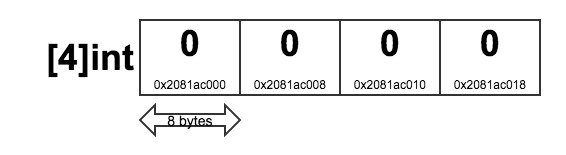
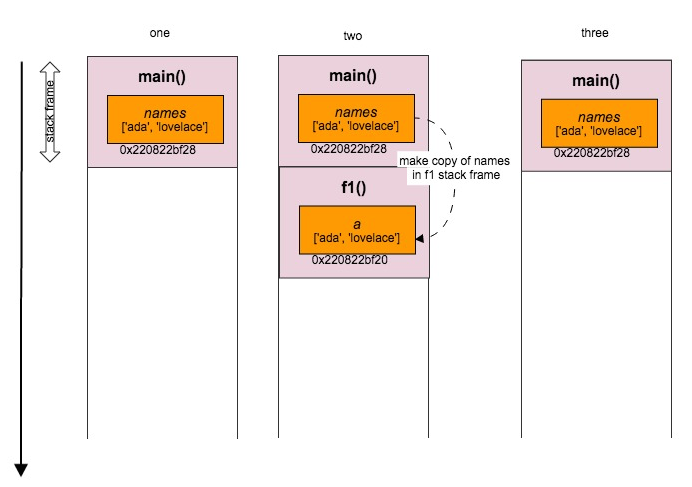
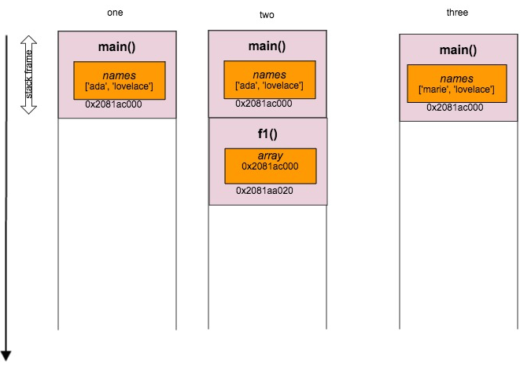

## Grokking Go: Arrays and Pass by Value

One of the lines you will hear over and over again as you learn Go is that it is **pass by value**. This post describes how arrays in Go are represented in memory and what it means to pass by value.

I was motivated to write this post because last week I had the opportunity to attend the [GothamGo](http://gothamgo.com/) conference here in New York which included a Go Workshop taught by [Bill Kennedy](http://www.goinggo.net/), one of the authors of [Go in Action](http://www.manning.com/ketelsen/). The best part of the workshop was that we got down into some of these fun lower level language details which I find REALLY interesting!

## Arrays
Let's start off with some basics. An array in Go is a container data structure of fixed length with values of a single type. The declaration below creates a zero-value array whose elements themselves are zero.

###### Listing 1.1

```go
var elements [4]int
```

In Go, when you declare a value of type `int`, then the actual size of the `int` will be determined based on the type of architecture the program is run on. In my case, I am running this program on my mac which is based on a 64bit architecture. This means each `int` will be 8 bytes long. It is important to note that `int` is its own type and is not an alias for `int64`. 

One thing that suprised me when I first learnt about it was that in Go the length of the array forms part of its type! The assignment in below will throw an error:

###### Listing 1.3
```go
var elements [4]int
var longElements [8]int

// ERROR: cannot use longElements (type [8]int) as type [4]int in assignment
elements = longElements		
```

### Arrays are stored contiguously in memory

In Go Arrays are stored **contiguously** in memory. The code below prints out the memory address of the array and of each of its elements:
###### Listing 1.2
```go
var el [4]int

fmt.Printf("el addr: %p \n", &el)

for i, e := range el {
	fmt.Printf("Value[%s] IndexAddr[%p] \n", e, &el[i])
}

### OUTPUT:
address of el array: 0x2081ac000
Value[0] IndexAddr[0x2081ac000]
Value[0] IndexAddr[0x2081ac008]
Value[0] IndexAddr[0x2081ac010]
Value[0] IndexAddr[0x2081ac018]
```

The below figure shows how the `el` array from Listing 1.2 looks in memory:
###### Figure 1.1


These memory addresses are in hexadecimal with each index located 8 bytes ahead of the last. The addresses you see in on your machine will likely differ to the ones shown in Listing 1.3. 
 See [Hexadecimal to Decimal](http://www.binaryhexconverter.com/hex-to-decimal-converter) converter.


#### What does this mean?

Contiguous memory has an advantage because it assists with keeping the data we are using in blocks that can potentially stay in the CPU’s caches longer. This in turn has performance benefits because the CPU doesn't have to flush the caches as often or look all the way back to RAM to access that memory. 

## Go is pass by value
In Go, everything is **pass by value**. This means that when we pass an array as an argument, we pass a copy of the array not a reference to the array.

Lets say we have the following program:
###### Listing 1.4
```go
func main() {
	names := [2]string{"ada", "lovelace"}
	fmt.Printf("Names address: %p \n", &names)
	f1(names)
	fmt.Println(names[0]) // still prints "ada"
}

func f1(array [2]string) {
	fmt.Printf("Value %s Addr: %p \n", array, &array)
	array[0] = "marie"
}

### OUTPUT:
Names address: 0x2081bc000
Value: [ada lovelace] Addr: 0x2081bc040
ada
```
In Go terminology we would say that `array` is a **value variable**.

##### There are two important things to take note of here: 
1. A copy of the `names` array variable is made when the `f1` function is called. <br/>
1. Inside `f1`, when we change the value of the first element in `array`, we are making a change to the copy: the local variable `array` inside the `f1` function. <br/>

#### What does the call stack look like?
Below is a simplified view of the call stack for Listing 1.4. You can see a copy of `names` is created on the `f1` stack frame which has its own address. When `f1` exits and is popped off the call stack and returns to `main` the `names` variable remains unchanged.

###### Figure 1.2


Copying the value of the array might be ok for small sized arrays, but what if the `names` array had millions of strings? The stack will need to grow very large and the runtime is starting to have to do a lot of work - creating and releasing megs of memory each time the `f1` function is called. 

Passing by value of `names` doesn't allow us to share its contents such that it can be modified by `f1`.

### Enter pointers!
If you have not so fond memories of your C programming class at college you might be tempted to close this tab right now - but don't do it just yet - pointers aren't that scary I promise! 

A pointer is simply a reference to a location in memory where a value is stored (not the value itself).

If we want to share `names` to `f1` so that we can modify it, we can instead pass a pointer of the `names` array. Pointers in Go are the size of one [machine word](http://en.wikipedia.org/wiki/Word_(computer_architecture)). On a machine with 64bit architecture the size of the word will be 8 bytes. So if `names` had millions of strings, passing a pointer uses much less memory! 

Let's update the code from Listing 1.4 to instead use a pointer:
###### Listing 1.5
```go
func main() {
	names := [2]string{"ada", "lovelace"}
	fmt.Printf("Names address: %p \n", &names)
	f1(&names)	// pass the value of the names address
	fmt.Println(names[0]) // prints "marie"
}

func f1(array *[2]string) {	// function accepts a pointer to an int array
	fmt.Printf("Value %p Addr: %p \n", array, &array)
	array[0] = "marie"
}

### OUTPUT:
Names address: 0x2081ac000
Value 0x2081ac000 Addr: 0x2081aa020
marie
```
In Go terminology we would say that `array` is a **pointer variable**.

In Listing 1.5 we can see that the address of `array` is `0x2081aa020` and the value is a copy of the address of `names`, `0x2081ac000`. When we update the first element of the array to be "marie", we actually update the value referenced in memory by the pointer.

#### What does the call stack look like now we are using a pointer?
Below you can see a simplified view of the call stack for Listing 1.5.

###### Figure 1.3


By using a pointer, we reduce the size of the stack on the call to `f1` and we are also able to change the value that the pointer points to; the `names` variable in `main`.

This has been a brief introduction into arrays internals and pass by value in Go!

## References & Further Reading
* [Go Data Structures](http://research.swtch.com/godata)
* [Understanding Pointers and Memory Allocation](http://www.goinggo.net/2013/07/understanding-pointers-and-memory.html)
* [Pass by Value](http://golang.org/doc/faq#pass_by_value)
* [Go Slices: usage and internals](http://blog.golang.org/go-slices-usage-and-internals)
* [Go in Action (book)](http://www.manning.com/ketelsen/)
