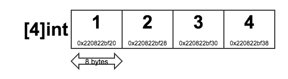

## Grokking Go: Array Internals and Pass by Value

One of the lines you will hear over and over again as you learn Go is that it is **pass by value**. This post describes how arrays in Go are represented in memory and what it means to pass by value.

I was motivated to write this post because last week I had the opportunity to attend the [GothamGo](http://gothamgo.com/) conference here in New York which included a Go Workshop taught by [Bill Kennedy](http://www.goinggo.net/), one of the authors of [Go in Action](http://www.manning.com/ketelsen/). 

The best part of the workshop was that we got down into some of these fun lower level language details which I find REALLY interesting!

## Arrays
Let's start off with some basics. An array in Go is a data structure that is fixed length collection of values of a single type. The declaration below creates a zero-value array where the value of each element is 0.

###### Listing 1.1

```go
var elements [4]int
```

In Go, when you declare a value of type `int`, then the actual size of the `int` will be determined based on the type of architecture the program is run on. In my case, I am running this program on my mac which is based on a 64bit architecture. This means each `int` will be 8 bytes long. It is important to note that `int` is its own type and is not an alias for `int64`. 

One thing that surprised me when I first learnt about this, was that in Go the length of the array forms part of its type! The assignment in the code below will throw an error:

###### Listing 1.2
```go
var elements [4]int
var longElements [8]int

// ERROR: cannot use longElements (type [8]int) as type [4]int in assignment
elements = longElements		
```

### Arrays are stored contiguously in memory

In Go, arrays are stored **contiguously** in memory. The code below prints out the memory address of the array and of each of its elements:
###### Listing 1.3
[(View in Go Playground](https://play.golang.org/p/CC018b-CR7)
```go
func main() {
	var a [4]int

	println("a addr:", &a)

	for i, e := range a {
		fmt.Printf("Value[%d] ", e)
		println("IndexAddr:", &a[i])
	}
}

### OUTPUT:
a addr: 0x220832bee8
Value[0] IndexAddr: 0x220832bee8
Value[0] IndexAddr: 0x220832bef0
Value[0] IndexAddr: 0x220832bef8
Value[0] IndexAddr: 0x220832bf00
```
>>>>>>>>>>>PUT SOMETHING HERE ABOUT println stuff

Figure 1.1 below  shows how the `a` array from Listing 1.3 looks in memory:
###### Figure 1.1


These memory addresses are in hexadecimal with each index located 8 bytes ahead of the last. The addresses you see on your machine may be different to the ones shown in Listing 1.2. 
 See [Hexadecimal to Decimal](http://www.binaryhexconverter.com/hex-to-decimal-converter) converter.

#### What does this mean?
Creating contiguous blocks of memory has an advantage because it assists with keeping the data we are using potentially in the CPU’s caches longer. This in turn has performance benefits because the CPU doesn't have to flush the caches as often or reach all the way back into RAM to access any memory it needs. 

## Go is pass by value
In Go, everything is **pass by value**. This means that when we pass an array as an argument, we pass a copy of the array not a reference to the array.

Lets say we have the following program:
###### Listing 1.4
[View in Go Playground](https://play.golang.org/p/aPuSADQxCQ)
```go
func main() {
	names := [2]string{"ada", "lovelace"}
	println("Names address:", &names)
	f1(names)
	fmt.Println(names[0]) // still prints "ada"
}

func f1(a [2]string) {
	fmt.Printf("Value: %s", a)
	println(" Addr:", &a)
	a[0] = "marie"
}

### OUTPUT:
names address: 0x220832df28
value: [ada lovelace], a address: 0x220832dec8
ada
```

##### There are two important things to take note of from Listing 1.4: 
1. A copy of the `names` array is made when the `f1` function is called. <br/>
1. Inside `f1`, when we change the value of the first element in `a`, we are making a change to the copy: the local variable `a` inside `f1`. <br/>

#### What does the call stack look like?
In figure 1.2 below, there is a simplified view of the call stack for Listing 1.4. You can see a copy of `names` is created in the `f1` stack frame and assigned to a variable called `a`, which has its own address. When `f1` returns, the stack pointer is once again pointing back to `main`s` stack frame and `names` remains unchanged.

###### Figure 1.2


Copying the value of the array in many cases is fine, but what if the `names` array had millions of strings? The stack will need to grow very large.

Passing `names` by value doesn't allow us to share its contents such that it can be modified by `f1`.

### Enter pointers!
If you have not so fond memories of your C programming class at college, you might be tempted to stop reading - but don't just yet - pointers aren't that scary, I promise! 

A pointer is a variable like any other variable, whose value is always an address. It references a location in memory where a value of a specified type is stored. Pointers can be used to share values between functions.

If we want to share `names` with `f1` so `f1` can modify it, we should pass the address of `names` to `f1`. Remember Go is pass by value where in this example, the value is an address.

Let's update the code from Listing 1.4 to instead use a pointer:
###### Listing 1.5
[View in Go Playground](https://play.golang.org/p/dFfCCyKmuE)
```go
func main() {
	names := [2]string{"ada", "lovelace"}
	println("Names address:", &names)
	f1(&names)
	fmt.Println(names[0]) // prints "marie"
}

func f1(a *[2]string) {
	fmt.Printf("Value: %p", a)
	println(" Addr:", &a)
	a[0] = "marie"
}

### OUTPUT:
names address: 0x2081ac000
value: 0x2081ac000, a address: 0x220832dec0
marie
```
In Go, we would say that `a` is a **pointer variable**.

In Listing 1.5, we can see that the address of `a` is `0x220832dec0` and the value is the address of `names`, `0x2081ac000`. When we update the first element of the array to be "marie", we actually update the value that the pointer points to.

#### What does the call stack look like now we are using a pointer?
Below you can see a simplified view of the call stack for Listing 1.5.

###### Figure 1.3


By using a pointer, we reduce the size of the stack on the call to `f1` and we are also able to change the value that the pointer points to; the `names` variable in `main`.

Pointer variables in Go are the size of one [machine word](http://en.wikipedia.org/wiki/Word_(computer_architecture)). On a machine with 64bit architecture the size of the word will be 8 bytes. So if `names` had millions of strings, passing a pointer uses much less memory! 

This has been a brief introduction into arrays internals and pass by value in Go! We have seen that arrays in Go are contiguous in memory where length forms part of its type. We also saw two examples of pass by value. In the first example when we passed an array as an argument we actually passed a prcopy of that array to the function. We learnt that when we wanted to share the contents of an array with a function we could pass a pointer to the array so that the function could then modify the original array.

If you want to get more involved in the Go community then come and join the [Gophers Slack group](http://blog.gopheracademy.com/gophers-slack-community/)!

## References & Further Reading
* [Go Data Structures](http://research.swtch.com/godata)
* [Understanding Pointers and Memory Allocation](http://www.goinggo.net/2013/07/understanding-pointers-and-memory.html)
* [Pass by Value](http://golang.org/doc/faq#pass_by_value)
* [Go Slices: usage and internals](http://blog.golang.org/go-slices-usage-and-internals)
* [Go in Action (book)](http://www.manning.com/ketelsen/)
