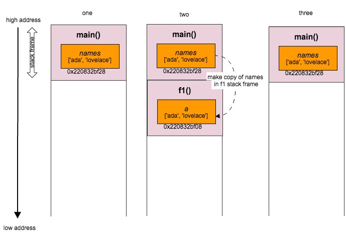
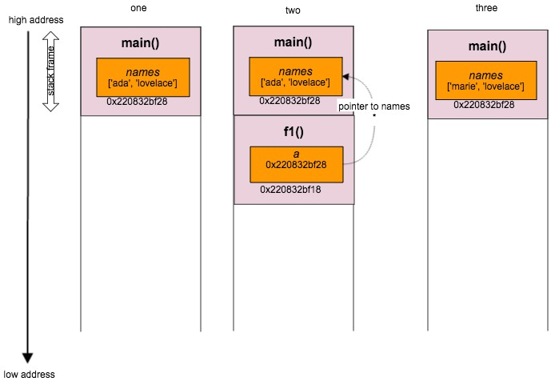

## Grokking Go: Arrays and Pass by Value

One of the lines you will hear over and over again as you learn Go is that it is **pass by value**. This post describes how arrays in Go are represented in memory and what it means to pass by value.

This post was spurred on by the fact that last week I had the opportunity to attend the [GothamGo](http://gothamgo.com/) conference here in New York which included a Go Workshop taught by [Bill Kennedy](http://www.goinggo.net/), one of the authors of [Go in Action](http://www.manning.com/ketelsen/). The best part of the workshop was that we got down into some of these fun lower level language details. 

### Arrays are stored contiguously in memory
An array in Go is a container data structure of fixed length with values of a single type. The declaration below creates a zero-value array whose elements themselves are zero.

```go
var elements [4]int
```
In Go, when you declare a value of type `int`, then the actual size of the `int` will be determined based on the type of architecture the program is run on. In my case, I am running this program on my mac which is based on a 64bit architecture. This means each `int` will be 8 bytes long. It is important to note that `int` is its own type and is not an alias for `int64`. 

Let's print out the memory address of the array and of each of its elements: 
```go
var el [4]int

fmt.Printf("el addr: %p \n", &el)

for i, e := range el {
	fmt.Printf("Value[%s] IndexAddr[%p] \n", e, &el[i])
}

OUTPUT:
address of elements array: 0x2081ac000
Value[0] IndexAddr[0x2081ac000]
Value[0] IndexAddr[0x2081ac008]
Value[0] IndexAddr[0x2081ac010]
Value[0] IndexAddr[0x2081ac018]
```

Interanlly an array is stored **contiguously** in memory.


These memory addresses are in hexadecimal with each index located 8 bytes ahead of the last. The addresses you see on your machine will likely differ to the ones shown above. 
 See [Hexadecimal to Decimal](http://www.binaryhexconverter.com/hex-to-decimal-converter) converter.

In Go, the length of the array forms part of its type. The assignment below will throw an error:

```go
var elements [4]int
var longElements [8]int

// ERROR: cannot use longElements (type [8]int) as type [4]int in assignment
elements = longElements		
```

Contiguous memory has an advantage because it assists with keeping the data we are using in blocks that can potentially stay in the CPU’s caches longer. This in turn has performance benefits because the CPU doesn't have to flush the caches as often or look all the way back to RAM to access that memory. 

#### Go is pass by value
In Go, everything is **pass by value**. This means that when we pass an array as an argument, we pass a copy of the array not a reference to the array.

Lets say we have the following program:
```go
func main() {
	names := [2]string{"ada", "lovelace"}
	fmt.Printf("Names address: %p \n", &names)
	f1(names)
	fmt.Println(names[0])
}

func f1(array [2]string) {
	fmt.Printf("Value %s Addr: %p \n", array, &array)
	array[0] = "marie"
}

OUTPUT
Names address: 0x2081ac000
Value: [ada lovelace] Addr: 0x2081ac040
ada
```
In Go terminology we would say that `array` is a **value variable**.



FIXME
fix diagram AND add title AND other things
##### There are two important things to take note of here: 
1. A copy of the `names` array variable is made when the `f1` function is called. <br/>
1. This means in `f1`, when we change the value of the first element, we are making a change to the copy. The local variable `array` inside the `f1` function. <br/>

Copying the value of the array might be ok for small sized arrays, but what if the `names` array had millions of strings? The stack will need to grow very large and the runtime is starting to have to do a lot of work - creating and releasing megs of memory each time the `f1` function is called. Passing by value here also doesn't allow us to share the contents of the original array so it can be modified by `f1`.

##### Use a pointer!
One way to overcome this would be to instead pass a pointer of the `names` array. Pointers in Go are the size of one [machine word](http://en.wikipedia.org/wiki/Word_(computer_architecture)). On a machine with 64bit architecture the size of the word will be 8 bytes.
```go
FIX ME
func main() {
	names := [2]string{"ada", "lovelace"}
	fmt.Printf("Names Address[%p] \n", &names)
	f1(&names)
	fmt.Println(names[0])	// "marie"
}

func f1(array *[2]string) {
	fmt.Printf("Array Address[%p] \n", &array)
	*array[0] = "marie"
}

OUTPUT
FIXME
```
In Go terminology we would say that `array` is a **pointer variable**.



By using a pointer, we reduce the size of the stack on the call to `f1` and this also allows us to change the value that the pointer points to ie. the array variable in `main`.

##### When do I use a `pointer` vs `value` variable?
There are a couple of scenarios for when using a pointer variable is the right choice: <br/>
1. Sharing. If you need to modify the contents of the variable. <br/>
2. Performance. If the variable is large then using a `pointer` variable will be more efficient. <br/>

This has been a brief introduction into arrays internals and pass by value in Go. I've tried to use diagrams to further illustrate these concepts.


## References & Reading
* [Go Data Structures](http://research.swtch.com/godata)
* [Understanding Pointers and Memory Allocation](http://www.goinggo.net/2013/07/understanding-pointers-and-memory.html)
* [Go Slices: usage and internals](http://blog.golang.org/go-slices-usage-and-internals)
* [Go in Action (book)](http://www.manning.com/ketelsen/)
